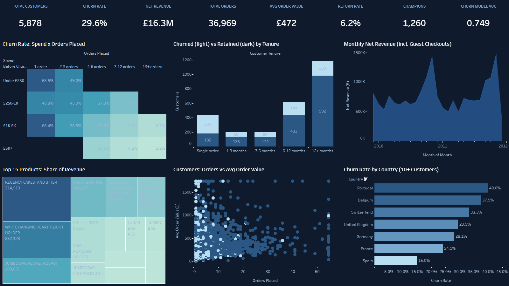

# Retail E-commerce Analytics and Customer Churn

Customer analytics on a real UK online retailer (UCI Online Retail II, 1.07 million transaction lines, December 2009-December 2011): revenue, returns, RFM customer segments, ABC product classes, and a churn model that predicts which recently active customers will stop buying in the next six months. End-to-end pipeline: Airflow, Great Expectations, dbt, PostgreSQL, XGBoost with SHAP, and Excel and Tableau dashboards generated from code.

[](https://public.tableau.com/app/profile/palaksh.chaturvedi/viz/Retail_Analytics_17909472448070/RetailCustomerAnalytics)

**[Open the interactive dashboard on Tableau Public](https://public.tableau.com/app/profile/palaksh.chaturvedi/viz/Retail_Analytics_17909472448070/RetailCustomerAnalytics)**

## Results (churn model, 662 test customers)

| Metric | Value |
|---|---|
| Churn rate (no positive net sales in the 6 months after 2011-06-09) | 29.6% |
| XGBoost AUC-ROC | 0.749 |
| Out-of-time check (trained on the 2010 snapshot) | AUC 0.768 |
| Precision / recall at 0.5 | 0.500 / 0.612 |

**The honest finding:** the model does **not** beat simply ranking customers by how few orders they placed (AUC 0.753 vs 0.749), and its accuracy equals predicting "retained" for everyone. The analytics (RFM, ABC, revenue and returns) are the strong part of this project; for churn I would ship the simple frequency rule or find features that add signal.

Also in the pipeline: six audit fixes (double-loaded days, credit notes counted as orders, returns counted as activity, and more), each with a dbt singular test that failed on the old model.

## Pipeline

```
data/raw/online_retail_ii.csv (1,067,371 lines, both Excel sheets combined)
  -> ingest (execute_values, 50k-row chunks) -> Great Expectations (7 hard gates)
  -> dbt: dedupe the overlapping sheets, separate credit notes, RFM with percent_rank, ABC (58 tests)
  -> churn snapshot in pandas (feature and outcome windows) -> XGBoost + SHAP -> Excel + Tableau
```

9 Airflow tasks, triggered by hand. Stack: Docker Compose, Airflow 2.9.3, PostgreSQL 15, Great Expectations 0.18.19, dbt 1.7.13, XGBoost, SHAP, openpyxl, Tableau Hyper API.

## Run it

1. Download `online_retail_ii.csv` from this repository's [Releases](../../releases) page and put it in `data/raw/`. (It is 107 MB, over GitHub's file limit, so it is not in the repository itself.)
2. Then:

```
cp .env.example .env            # set POSTGRES_PASSWORD and HOST_PROJECT_DIR
docker compose up -d --build    # Postgres :5434, Airflow UI http://localhost:8083
docker compose exec airflow-scheduler airflow dags trigger retail_pipeline_dag
```

A full run takes about 3 minutes. The Airflow login is set in `docker-compose.yml` and is for local use only.

## More detail

[README_PIPELINE.md](README_PIPELINE.md) has the full architecture, the churn definition, the six audit fixes (with before and after numbers) and the verified run evidence.

Data: UCI Machine Learning Repository, "Online Retail II" (Chen, 2019), CC BY 4.0.
